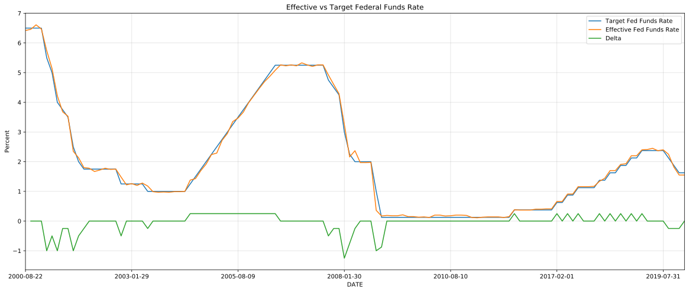
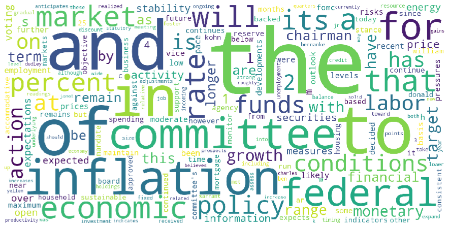
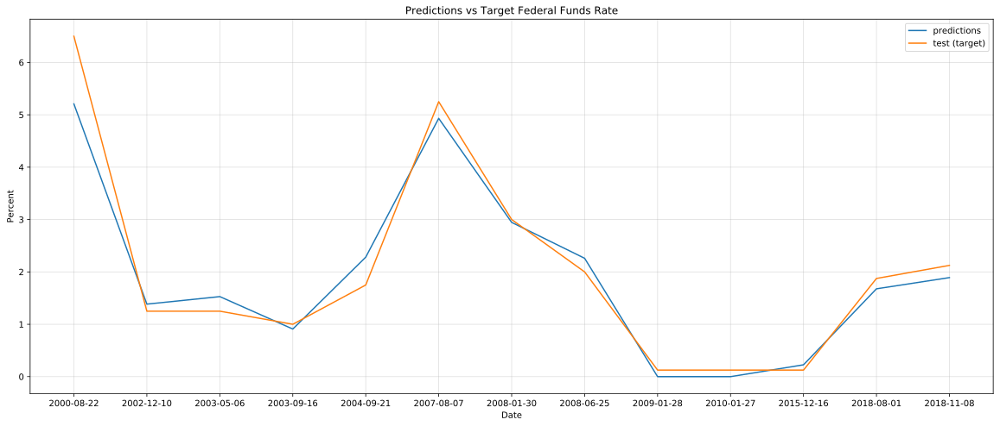
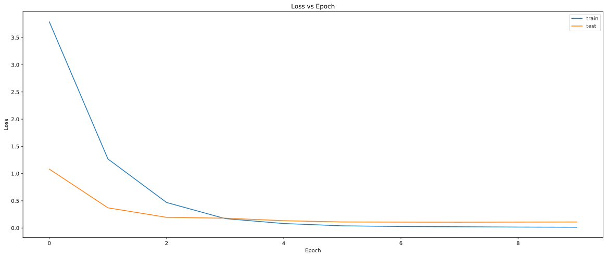

# PredictTargetFederalFundsRate
Using Natural Language Processing and a Long Short-Term Memory network to predict the target federal funds rate set by the Federal Open Market Committee.

## Introduction

### The Federal Reserve and the Federal Open Market Committee 

The Federal Reserve, the central bank of the United States and commonly referred to as the Fed, conducts monetary policy to stimulate the economy. The **Federal Open Market Committee (FOMC)** is a branch of the Fed which meets **eight times a year to set a Target Federal Funds Rate**.

### Fed Funds Rate

The Fed Funds Rate is the interest rate banks charge each other for overnight loans in order to meet the reserve ratio set by the Federal Reserve. The Fed sets a target rate as a guideline for banks.

### How the Fed Funds Rate affects us

**Banks use this interest rate to control all other interest rates**, such as both short-term and long term loans. It also affects credit card rates, mortgate rates, etc. Remember, the Fed uses monetary policy to stabilize the economy to a healthy growth rate. Because the Target Fed Funds Rate affects interest rate, it controls investment spending and therefore Real GDP.

### Why use Machine Learning in Macroeconomics?

* The FOMC **relies heavily on lagging economic indicators** to make its interest rate decisions
* Decisions rely on economic theory, which may fail to predict recessions. Machine learning models uncover patterns in data and **eliminate the "constraints of theory"**, giving more insight into the trends of the economy.
* Better predicts **early signs of potential market and bank failure**

### How can we implement machine learning to predict the Target Federal Funds Rate

1.  Acquire data about the statements released by the FOMC after each meeting. This will be done by scraping the Federal Reserve Website
2.   Acquire the Target Federal Funds data by downloading a constantly updated excel sheet
3.   Preprocessing the data to train a model. This involves only using data which matches from all resources as well as cleaning up the text sequences.
4.   Explore the data further by identifying the similarities between the actual and target Fed Funds rates, visualizing the change in the target Fed Funds rate after each meeting, and envisioning the most common words in the FOMC statements.
5.   Use Natural Language Processing to train a Long Short-Term Memory network which predicts the rates in a time series format.